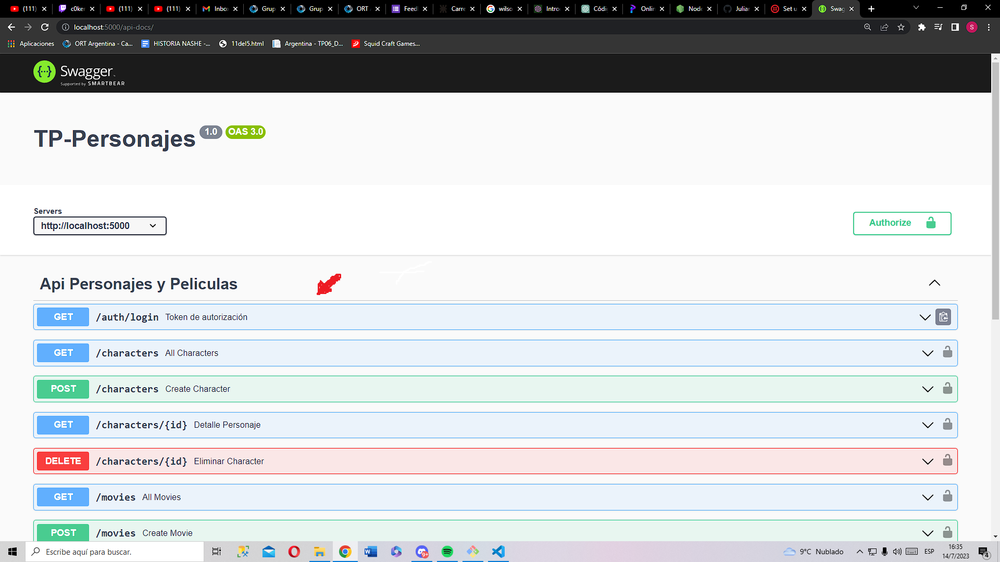
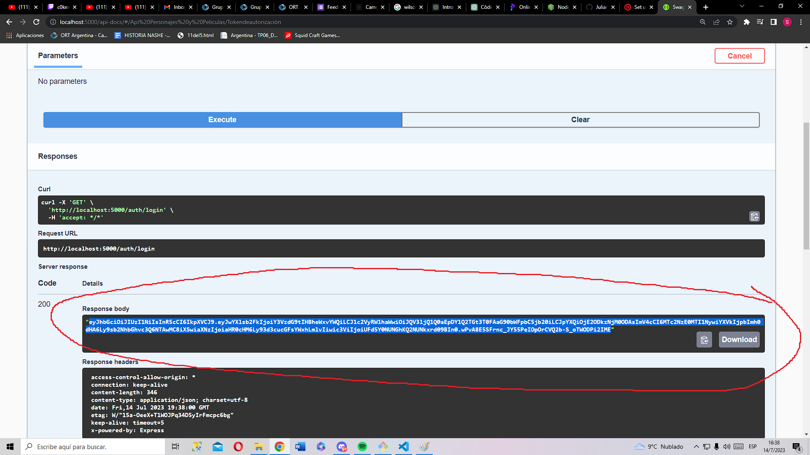
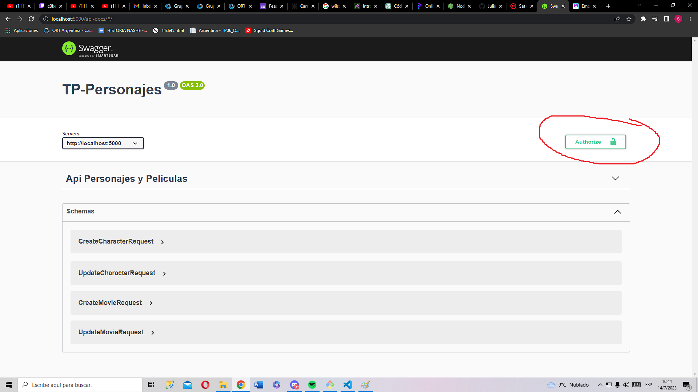

# TP-Personajes

This project is an API that interacts with a database of characters and movies.
It provides various endpoints to perform **CRUD** operations and search functionalities on characters and movies.
The API allows *creating*, *updating*, and *deleting* characters and movies.
Additionally, it provides endpoints to retrieve details of specific characters, search characters by parameters, and retrieve all movies.
Users can also create new movies, update existing movies, delete movies, and search movies based on parameters.
The project is designed to facilitate the management and retrieval of data related to characters and movies.

## Installation


1. Clone / Download Repository

```bash
git clone https://github.com/monkeyloko/TP-Personajes.git
```

2. Install everything needed to run a NodeJS project.

- [NodeJS](https://nodejs.org/es)


- Install express.js ```
                        npm i express
                    ```


3. Install dependencies

```bash
npm i
```

## Set up

1. Create MSSQL Database

2. Run the scripts "***DAI-Personajes.sql***" and "***01 - CreateLoginUser.sql***" in SQL

3. Open the file **.env** and paste the name of the server in ***DB_SERVER***

## Running the Project

Once you have everything set up, to run the project, you need to enter the following command in the terminal: `npm start`

If there was an issue and the project didn't start, it could be due to the following reasons:
- NPM is not updated. In that case, run the command `npm install npm@latest -g` to update it to the latest version

When you see the message `Server is listening on port: 5000` in the terminal, it means the project is running successfully

## API Authentication

To use the api endpoints with Swagger you must use this [url](localhost:5000/api-docs)

1. Firstly, click on the auth/login endpoint.



2. **Copy** the token 



3. Click on ***Authorize :unlock:*** 


4. **Paste** the token


---
## Api Endpoints Explanation.

### Create Character

Endpoint: POST /characters/

Functionality: Create a new character

### Update Character

Endpoint: PUT /characters/{id}

Functionality: Update an existing character

### Delete Character

Endpoint: DELETE /characters/{id}

Functionality: Delete an existing character

### Character Details

Endpoint: GET /characters/{id}

Functionality: Get details of a specific character

### Search Character by Parameter

Endpoint: GET /characters

Functionality: Search characters based on a parameter

### All Movies

Endpoint: GET /movies/

Functionality: Get all movies

### Create Movie

Endpoint: POST /movies/

Functionality: Create a new movie

### Update Movie

Endpoint: PUT /movies/{id}

Functionality: Update an existing movie

### Delete Movie

Endpoint: DELETE /movies/{id}

Functionality: Delete an existing movie

### Search Movie by Parameter

Endpoint: GET /movies

Functionality: Search movies based on a parameter

---
Made by: **Santiago Doff** and **Joaquin Maceira**
